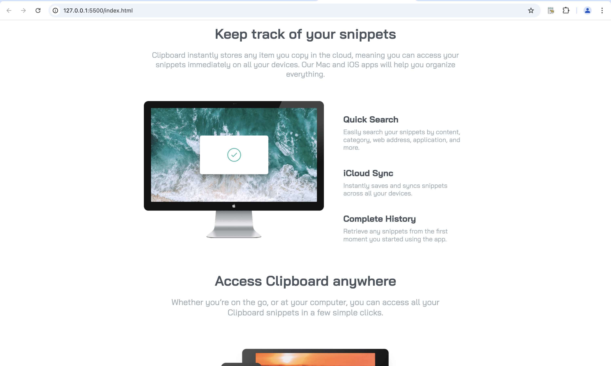

# Landing Page - Frontend Mentor Challenge

This is my solution to the [Frontend Mentor](https://www.frontendmentor.io/) landing page challenge. The project was built using only HTML and CSS.

## Project Overview

This landing page project focuses on creating a clean, responsive design that demonstrates basic HTML and CSS skills. It was built as part of a challenge to practice layout and design techniques.

### Features:
- **Responsive Design**: The page adapts well to different screen sizes.
- **Clean Layout**: The structure follows a simple and effective layout.
- **No JavaScript**: This is a static landing page built only with HTML and CSS.

## Technologies Used:
- **HTML**: For the structure of the webpage.
- **CSS**: For styling and layout.
  - Flexbox / Grid (if you used it)
  - Media Queries (if used for responsiveness)

## Installation

To view the project locally:

1. Clone the repository:
   ```bash
   git clone https://github.com/decencyokobia/landing-page1.git
   ```

2. Open the `index.html` file in your preferred browser.

## Preview

Here’s a screenshot of what the landing page looks like:



